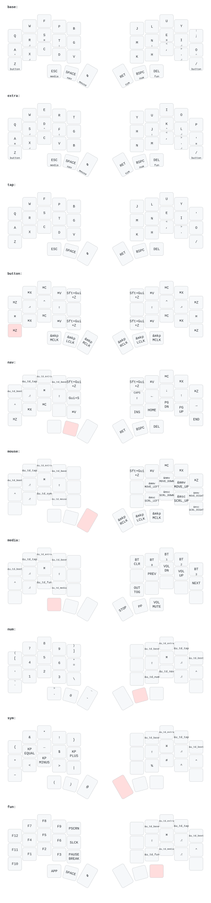

# Temper ZMK Config

This is my personal ZMK config for the [temper](https://github.com/raeedcho/temper).

The keymap is a port of my QMK [Miryoku](https://github.com/manna-harbour/miryoku) build,
kept in sync with `users/manna-harbour_miryoku` in my qmk_firmware fork.

Some notes about this config:
- Ten layers: Base, Extra, Tap, Button, Nav, Mouse, Media, Num, Sym, Fun
- Base is Colemak-DH with `;` on the top right pinky; Extra is QWERTY, Tap is Colemak-DH
  without home row mods. All three are alternative default layers.
- Home row mods, inner-to-outer: Ctrl / Alt / Gui / Shift, with AltGr on `X` and `.`
- Thumbs are layer-taps: Esc/Media, Space/Nav, Tab/Mouse — Enter/Sym, Bksp/Num, Del/Fun
- Clipboard keys use the Mac bindings (`MIRYOKU_CLIPBOARD=MAC`)
- Tapping term is 175ms, tap-preferred (matches the QMK build, which sets neither
  `PERMISSIVE_HOLD` nor `HOLD_ON_OTHER_KEY_PRESS`)
- The Extra/Tap/Base/Nav/Mouse/Media/Num/Sym/Fun selectors and the bootloader key are
  double-tap guarded, as in Miryoku

Differences from the QMK build:
- Miryoku's RGB keys on the Media layer become Bluetooth profile selection, since the
  temper has no underglow; `OU_AUTO` becomes `&out OUT_TOG`
- QMK auto-shift (`AUTO_SHIFT_ENABLE` with `NO_AUTO_SHIFT_ALPHA`) has no ZMK equivalent
  and is not implemented

